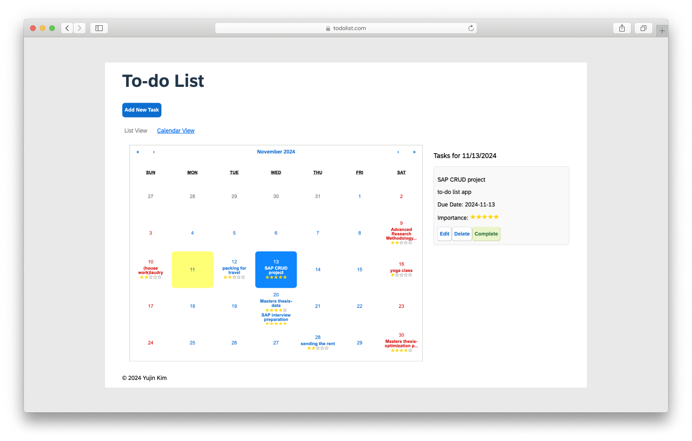

<h1 align="center">
  <a>
    To-do list application
  </a>
</h1>

<p align="center">
  A simple To-do list <a href="https://www.codecademy.com/articles/what-is-crud">CRUD</a> application built with <a href="https://reactjs.org">React</a>
</p>




## Technologies Used

- [React](http://reactjs.org)
- [SweetAlert2](https://sweetalert2.github.io)

## Development

To get a local copy of the code:

```
git clone https://github.com/yudinii/CRUD_todolist.git
cd CRUD_todolist
```

Install dependencies:

```
npm install
```

Start a local web server by running:

```
npm run dev
```

Open local port to view it in the browser.

```
http://localhost:5173
//Note: If port 5173 is in use, the project may automatically use another available port (e.g., 5174).
```

#### Available Scripts

| Script        | Description                                                             |
| ------------- | ----------------------------------------------------------------------- |
| npm start     | Runs the app in the development mode.                                   |
| npm test      | Launches the test runner in the interactive watch mode.                 |
| npm run build | Builds the app for production to the `build` folder.                    |
| npm run eject | This command will remove the single build dependency from your project. |
